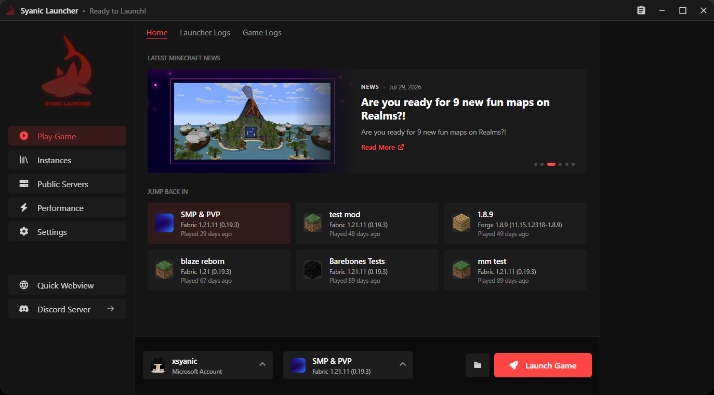
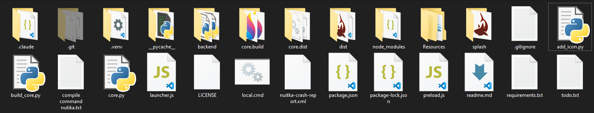

## SyanicLauncher (work in progress)
This is the rewrite of SyanicLauncher in GoLang with Wails from scratch while using Vanilla HTML/CSS/JS for the frontend.

#### todos:
- Build a decent frontend
- Go Package for Minecraft Go from scratch (pain)
- Support for various Minecraft modloaders

#### rules:
- Readable and maintainable code
- Avoid AI slop, can be only used in making frontend designs, that too must also have taste and not be slopped & maintainable

#### preview of old SyanicLauncher:

#### why?
Old SyanicLauncher was written in Python + Electron and was totally unmaintainable with a monolithic codebase.

(Click to preview)

yeah this shi was a mess

There were occasional issues with the launcher not working as expected, issues with python itself, compilation times, size of the compiled artifact due to bundled electron and python making it unpleasing and unperformative.

GoLang + Wails + Vanilla HTML/CSS/JS is a much better combination for a modern, maintainable launcher without compromising and would also help me get better at GoLang.

### commands:
For development: `wails dev`
For building: `wails build`

Go and required dependencies must be installed.
